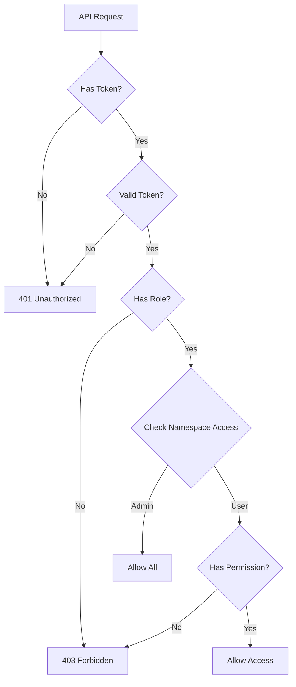

# Keycloak Authentication & User Management

## Overview

This tenant management system now includes Keycloak-based authentication with fine-grained namespace-level access control.

## Features

### 1. **Keycloak Authentication**
- OAuth2/OIDC JWT token validation
- Role-based access control (RBAC)
- Automatic token refresh
- Development mode with auth bypass

### 2. **Namespace-Level Permissions**
- Grant specific users access to specific namespaces
- Admins can access all namespaces
- Regular users can only access assigned namespaces
- Permission management through web UI

### 3. **User Roles**
- `admin` / `tenant-admin`: Full access to all namespaces and user management
- `tenant-operator`: Can manage tenants in assigned namespaces
- `tenant-viewer`: Read-only access to assigned namespaces

## Database Schema

### `user_namespaces` Table
```sql
CREATE TABLE user_namespaces (
    user_id VARCHAR(255),           -- Keycloak user sub (UUID)
    namespace VARCHAR(255),         -- Kubernetes namespace name
    enabled BOOLEAN DEFAULT true,   -- Whether permission is active
    granted_by VARCHAR(255),        -- User who granted permission
    granted_at TIMESTAMP,          -- When permission was granted
    revoked_at TIMESTAMP,          -- When permission was revoked
    PRIMARY KEY (user_id, namespace)
);
```

## API Endpoints

### User Management (Admin Only)

#### Grant Namespace Access
```bash
POST /api/v1/admin/users/namespaces
{
  "user_id": "a1b2c3d4-e5f6-7890-abcd-ef1234567890",
  "namespace": "pvg-demo"
}
```

#### Revoke Namespace Access
```bash
DELETE /api/v1/admin/users/{user_id}/namespaces/{namespace}
```

#### List User's Namespaces
```bash
GET /api/v1/admin/users/{user_id}/namespaces
```

#### List All Permissions
```bash
GET /api/v1/admin/users/namespaces
```

#### List Namespace Users
```bash
GET /api/v1/admin/namespaces/{namespace}/users
```

## Configuration

### Environment Variables

#### Backend (ConfigMap)
```yaml
KEYCLOAK_URL: "https://keycloak.yourdomain.com"
KEYCLOAK_REALM: "tenant-management"
KEYCLOAK_CLIENT_ID: "tenant-manager-backend"
DEBUG: "false"  # Set to true to enable auth bypass
```

#### Backend (Secret)
```yaml
KEYCLOAK_CLIENT_SECRET: "your-client-secret-here"
```

#### Frontend (.env.production)
```bash
VITE_KEYCLOAK_URL=https://keycloak.yourdomain.com
VITE_KEYCLOAK_REALM=tenant-management
VITE_KEYCLOAK_CLIENT_ID=tenant-manager-frontend
VITE_API_BASE_URL=/tm
```

## Keycloak Setup

### 1. Create Realm
- Name: `tenant-management`

### 2. Create Backend Client
- Client ID: `tenant-manager-backend`
- Client Protocol: `openid-connect`
- Access Type: `confidential`
- Service Accounts Enabled: `ON`
- Authorization Enabled: `ON`
- Valid Redirect URIs: `*` (or specific URLs)

### 3. Create Frontend Client
- Client ID: `tenant-manager-frontend`
- Client Protocol: `openid-connect`
- Access Type: `public`
- Standard Flow Enabled: `ON`
- Direct Access Grants Enabled: `ON`
- Valid Redirect URIs: `https://tm.yourdomain.com/*`
- Web Origins: `https://tm.yourdomain.com`

### 4. Create Roles
Navigate to Realm Settings → Roles → Create Role:
- `admin`
- `tenant-admin`
- `tenant-operator`
- `tenant-viewer`

### 5. Create Users
1. Navigate to Users → Add User
2. Set username, email, first name, last name
3. Go to Credentials tab → Set password
4. Go to Role Mappings → Assign roles

## Usage

### Development Mode (Auth Bypass)

When `DEBUG=true` or Keycloak is not configured:
```python
# Backend returns mock user
{
    "sub": "dev-user-123",
    "email": "dev@example.com",
    "preferred_username": "developer",
    "name": "Development User",
    "roles": ["admin", "tenant-admin"],
    "allowed_namespaces": ["*"]
}
```

### Production Mode

#### 1. User Authentication Flow
1. User visits `/tm/`
2. Redirected to Keycloak login
3. After successful login, receives JWT token
4. Token included in all API requests via `Authorization: Bearer <token>`

#### 2. Token Validation
- Backend extracts token from `Authorization` header
- Validates signature using Keycloak public key
- Extracts user info and roles from token
- Checks namespace permissions from database

#### 3. Authorization Flow


### Managing User Permissions

#### Via Web UI (Admin Only)
1. Navigate to **User Management** in sidebar
2. Click **Grant Access** button
3. Enter User ID (Keycloak sub from token)
4. Select Namespace from dropdown
5. Click **Grant Access**

#### Via API
```bash
# Get user's Keycloak sub from JWT token
TOKEN="eyJhbGciOiJSUzI1NiIsInR5cCI6IkpXVCJ..."

# Grant access
curl -X POST https://tm.yourdomain.com/api/v1/admin/users/namespaces \
  -H "Authorization: Bearer $TOKEN" \
  -H "Content-Type: application/json" \
  -d '{
    "user_id": "a1b2c3d4-e5f6-7890-abcd-ef1234567890",
    "namespace": "pvg-demo"
  }'

# Revoke access
curl -X DELETE https://tm.yourdomain.com/api/v1/admin/users/{user_id}/namespaces/{namespace} \
  -H "Authorization: Bearer $TOKEN"
```

## Security Best Practices

### ✅ Implemented
- JWT token validation with public key verification
- Role-based access control (RBAC)
- Namespace-level permissions
- Token expiration checking
- Secure password storage in Keycloak

### 🔜 Recommended for Production
- Enable HTTPS/TLS for all communications
- Set proper CORS origins (no wildcards)
- Implement rate limiting
- Enable audit logging for all permission changes
- Regular token rotation
- Set up token refresh mechanism
- Implement MFA in Keycloak
- Use Kubernetes network policies
- Enable pod security policies

## Troubleshooting

### Issue: "Auth bypass enabled" warning in logs
**Solution**: Set `DEBUG=false` and configure proper Keycloak URL

### Issue: 401 Unauthorized
**Causes**:
1. No token provided → User needs to login
2. Invalid token → Token expired or tampered
3. Keycloak service unavailable → Check Keycloak URL

**Solution**: Check browser console for token, verify Keycloak is accessible

### Issue: 403 Forbidden
**Causes**:
1. User lacks required role
2. User not granted namespace access

**Solution**: 
1. Check user roles in Keycloak
2. Grant namespace access via User Management page

### Issue: Empty tenant list
**Cause**: User has no namespace permissions

**Solution**: Admin needs to grant namespace access to user

## Migration from Auth Bypass

### Step 1: Set up Keycloak
Follow Keycloak Setup section above

### Step 2: Update Configuration
```bash
# Update ConfigMap
kubectl edit configmap backend-config -n tenant-management

# Set:
KEYCLOAK_URL: "https://keycloak.yourdomain.com"
KEYCLOAK_REALM: "tenant-management"
KEYCLOAK_CLIENT_ID: "tenant-manager-backend"
DEBUG: "false"

# Update Secret
kubectl create secret generic backend-secrets -n tenant-management \
  --from-literal=KEYCLOAK_CLIENT_SECRET="your-secret" \
  --dry-run=client -o yaml | kubectl apply -f -
```

### Step 3: Restart Backend
```bash
kubectl rollout restart deployment backend -n tenant-management
```

### Step 4: Create Users and Grant Permissions
1. Create users in Keycloak
2. Assign roles to users
3. Use User Management UI to grant namespace access

## Testing

### Test Authentication
```bash
# Get token from Keycloak
TOKEN=$(curl -X POST "https://keycloak.yourdomain.com/realms/tenant-management/protocol/openid-connect/token" \
  -d "client_id=tenant-manager-frontend" \
  -d "username=testuser" \
  -d "password=testpass" \
  -d "grant_type=password" \
  | jq -r '.access_token')

# Test API access
curl https://tm.yourdomain.com/api/v1/tenants \
  -H "Authorization: Bearer $TOKEN"
```

### Test Permission System
```bash
# As admin, grant access to user
curl -X POST https://tm.yourdomain.com/api/v1/admin/users/namespaces \
  -H "Authorization: Bearer $ADMIN_TOKEN" \
  -H "Content-Type: application/json" \
  -d '{
    "user_id": "user-sub-from-token",
    "namespace": "pvg-demo"
  }'

# As user, verify access
curl https://tm.yourdomain.com/api/v1/tenants \
  -H "Authorization: Bearer $USER_TOKEN"
```
